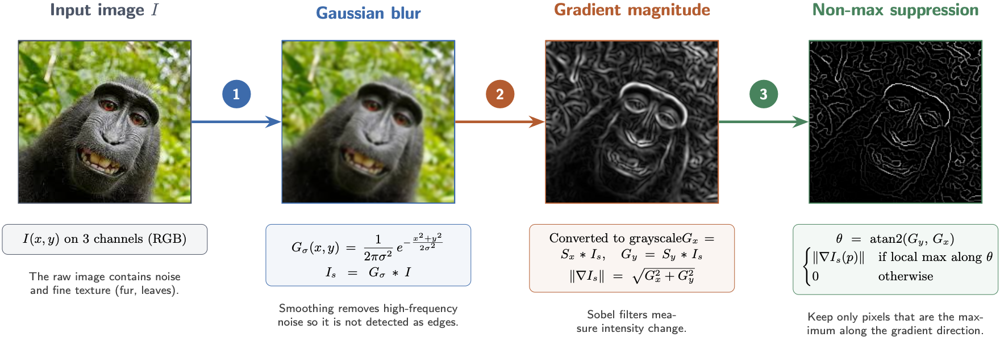

# Computer Vision

This project implements some computer vision algorithms 

## Algorithms

- **[core/edge_detection.py](core/edge_detection.py)**

  

Note : the blur (step 1) and gaussian magnitude (step 2) are actually made together using DoG (Derivative of Gaussian)


## Usage

```sh
make run ALGO=edge_detection IMAGE=input/photo.jpg
make test                                  
make clean                                                            
```

## Layout

- `core/`   — algorithms (`filters.py`) and image I/O (`image_io.py`)
- `input/`  — source images
- `output/` — generated results
- `tests/`  — pytest tests for each function in `core/`
- `main.py` — command-line entry point
